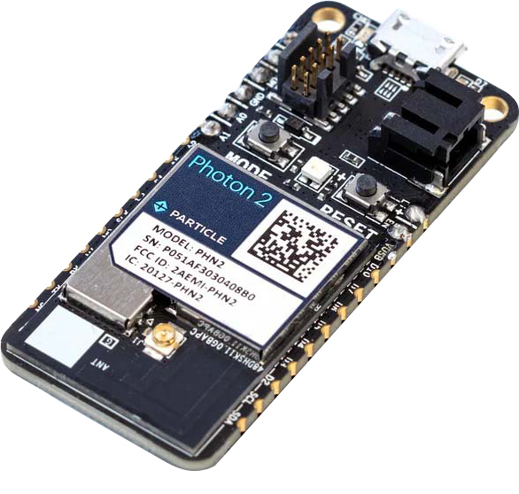

# Sentinel Hardware Components

## Devices

### Intel RealSense Depth Camera D415
In the Mini III’s top PVC box, on either side of the
Jetson Orin Nano, sit two Intel RealSense D415 cameras
affixed to a bottom plate acrylic using nuts and bolts, and
facing out through clear acrylic windows. The upgrade from
simple RGB cameras to the D415 stereo vision depth
camera system is perhaps the most significant advancement
in the Sentinel project timeline. These cameras allow the
system to gather depth images as well as the visual RGB
images, and even overlap these streams simultaneously to
gain a more fundamental, three-dimensional, understanding
of objects in the system’s environment. Depth images, like
RGB images, are an array of pixels, but instead of each
pixel containing a color value, each pixel in a depth image
has a value which represents the distance away from the
camera [1]. The calculation of these distance values is
achieved using the stereo vision technique, which simply
refers to the use of two images in viewing a single
object/scene, and using the known difference in the
perspective of these imagers to calculate a numeric value of
distance away from the imaging pair at every point (or
pixel) in the scene [1]. The imaging module in the D415
camera consists of a left and right IR imager, an RGB sensor
integrated next to the right IR imager (when facing the
camera) for color capture, and an infrared (IR) projector in
between the left and right imager (see Figure 1). The IR
project emits an invisible static IR pattern onto the scene
being captured to enhance texture and improve the depth
accuracy [1]. All imaging data is sent to the processing
module within the D415 camera to perform depth
calculations.

Upgrading to the D415 cameras has broadened the
horizons for the Sentinel project. Not only will this depth
sensing technology improve the ability of the system to
identify and track crop disease, but it will also allow the
system to accurately measure crop growth, as we have
already rudimentarily proven through testing (see
Experimentation section). A remote system capable of
measuring features of crop growth such as canopy merging,
stem growth, or internode distance is especially useful when
growing plants like cotton which require weekly observation
to determine when plant growth regulator (PGR) application
is needed [2].

### NVIDIA Jetson Orin Nano
The NVIDIA Jetson Orin Nano (Orin for short) is
another significant hardware upgrade in the Mini III.
Running on Ubuntu, Orin is the brain of the Mini III system,
it currently handles the image capture and processing,
weather input, and saving of all the recorded data. Most
importantly, it will run the AI model once built. Compared
to the Jetson Nano in the Sentinel Mini II, the Orin has
“5.4x the CUDA compute, 6.6x the CPU performance, and
50x the performance per watt” [3], bringing the Sentinel
project to the cutting edge of AI platforms.
The immense processing power of the Orin comes
at the cost of large power consumption, challenging the
longevity of a remote system. Thus the system is designed
to power on the Orin only when image and weather data
needs to be captured and shut off shortly after. When AI is
introduced, the system would necessarily have to operate in
a similar manner (i.e. turn on the Orin for a short period,
analyze the environment, record data, alert if something of
interest is detected, and then shut off).

### Particle Photon 2
The Photon Particle 2 (P2) is a development
module with a microcontroller and Wi-Fi capabilities. The
photon can be set up and registered through the Particle
website, at which point it can be programmed and flashed
through the browser-based IDE via Wi-Fi, or programmed
using software like Visual Studio Code and flashed via
USB. With 2MB of memory, the device is more than
capable of running a sophisticated system such as the
sentinel mini. This device serves as the main controller for
the Sentinel, communicating with/ enabling many other
devices to create a working system. The P2 reads time from
the RTC, reads positional data from the GPS, controls the
E-Ink display, detects user input from buttons, and enables/
disables power to the Jetson Orin and AB02S LoRaWAN
module when necessary. The photon uses an assortment of
libraries coded in C++ to enable it to properly utilize the
external modules like the GPS and RTC.

### AB02S LoRaWAN Module
The Cube Cell HTTC-AB02S is a
LoRaWAN-specific development board with a built-in GPS.
LoRaWAN is a “Low Power, Wide Area (LPWA)”
networking protocol that is used to keep battery power
devices connected to the internet when direct Wi-Fi
connection is not an option [4]. Because the Sentinel will be
deployed in a rural crop field for extended periods of time,
LoRaWAN is useful for transmitting information to
gateways up to 10 kilometers away, while operating in low
power mode for efficient energy usage [5]. The device is
arduino compatible, and was once again programmed using
C++ to serve as a LoRaWAN transmitter. Currently, the only
communication between the Photon and the AB02S is a
single GPIO pin, which is being used to transmit an
emergency flag from the Photon to the AB02S; future
iterations could send additional information to the AB02S
using other communication protocols such as I2C or UART.

### BME280 Temperature/Humidity/Pressure Sensor
The BME280 is an environmental temperature,
humidity, and barometric pressure sensor from Adafruit. It
is connected directly to the Orin using I2C communication
and it transmits its data to be saved whenever the Orin boots
up (see Software section). The weather data captured from
this sensor adds to the data set that will eventually be used
to train the AI model.

### DS1307 Real Time Clock
To properly store time, the Sentinel utilizes a real
time clock module. The particular model is a DS1307
breakout board from Adafruit, but the functionality is the
same as any other RTC. Once the device has been initialized
with the current time, the crystal oscillator within the device
will increment and continue counting until it is manually
updated. Even in the event of a power outage, the RTC is
able to continue incrementing using a CMOS battery,
ensuring that it always has the right time. In our system, we
use a GPS to provide incremental updates to the RTC to
ensure its accuracy. The RTC is connected to the photon
using I2C, and is read at the beginning of each loop to see
whether or not a picture needs to be taken.

### Ultimate GPS Module
The GPS module is responsible for receiving the
current time and current position of the Sentinel. This
module is different from the onboard GPS built into the
AB02S, and seems to acquire signals much better. This
module communicates with the Photon 2 via UART serial
connection, and provides latitude, longitude, time and date.
Information is constantly being pulled from the GPS, and
every 7 days the information is used to update the time on
the RTC to ensure accuracy, as long as the GPS has a signal.
One of the drawbacks of the GPS is that it has difficulty
receiving a signal in some buildings, such as the NEB
design room.

### E-Ink Display
To display information to the user, we are using an
E-Ink display, which is a low-power alternative to normal
LCD displays. The device is connected to the photon via
SPI, and is written to at certain intervals to display
information such as the currently set time period between
photos. In this iteration, we have had errors with the display
writing messages diagonally on the screen, but the message
is still legible in most cases.

### Microcontroller Managed Power Switch
For a system like the Sentinel Mini III where it is
meant to remain functional for months at a time without
human aid, power management is of the utmost importance.
Although the large 12V battery will be continuously charged
during the day by a solar panel, the power draw from the
Orin module would quickly run the battery dead and render
the system inoperable if left continuously running.
Therefore, it is necessary to create a system in which the
Orin, and other power draining sources that aren’t always
needed, can be switched off and on at will. Thus, the Mini
III system has two power switches managed by the Particle
Photon 2. The first controls the 12V power to the Orin, and
the second controls the 5V power to the LoRaWAN module.
They both operate exactly the same, the only difference is
the power source being blocked. The power switch consists
of one PMOS (IRF9Z34), one NMOS (BS270), one 1MΩ
resistor, and one 1kΩ resistor connected as seen in Figure 9
in the appendix. When the microcontroller needs to turn on
either the Orin or LoRaWAN module it simply sends a 3.3V
output pulse from a GPIO pin to the gate of the NMOS.

### The SwitchDoc Labs Grove/Pin Dual WatchDog Timer
A watchdog timer is a hardware or software
mechanism used in computer systems to detect and recover
from any malfunctions. As a timer, it monitors the execution
of a program. If the program fails to respond and send the
external hardware module a check signal within a certain
time interval, the watchdog timer resets the system.
The external watchdog timer used in this project
was the SwitchLab Docs Dual WatchDog Timer, this timer
is based on the 555 timer IC as a continuous pulse generator.
Configuring the watchdog to the Photon Particle 2 was
similar to configuring it to an Arduino compatible device
where connecting “the DOG_ARDUINORESET directly to
the RESET pin on the Arduino and connect the
DOG_TRIGGER to any available GPIO pin on the
Arduino” [6]. Once this connection is made it starts
operating on power up, or any time the trigger input is
brought to ground. The setting of the on-board
potentiometer determines the length of the pulse time frame
(30-240 seconds). If the watchdog’s trigger does not receive
the “OK” check from the GPIO pin of the Particle 2 within
the time frame that was set on the hardware module, the
reset will then send the signal to ground for approximately
500 ms. Once this is completed the entire system will restart
allowing the system to start over again.

### Power management: DFRobot Solar Power Manager
The main portion of the power management is
controlled by the DFRobot Solar Power Manager. This
manager allows for the input power of the system to be from
either a 12V battery or a solar cell. The board has a 5V 5A,
12V 8A, and two 5V 2.5A USB outputs. The 5V and 12V
outputs are then connected to the switching circuits where
the system can be powered and run the Photon Particle 2
and the Orin with the correct voltage.

## System Housing & Hardware Assembly Package
The entire system is housed in two sealed and
weatherproof PVC junction boxes, consisting of a larger
bottom box and a smaller top box caulked with waterproof
silicon to the top. The bottom box contains the 12V battery,
DFRobot Solar Power Manager, entire system circuitry
(Particle Photon 2, RTC, LoRaWAN, GPS, E-Ink,
Watchdog, power switching circuit), and the three buttons.
The top box contains the two Intel Realsense cameras and
the Jetson Orin Nano, with a layer of clear acrylic protecting
the camera lenses. Both boxes contain acrylic bases that
hold the system in place using nuts and bolts. The bottom
box contains a couple holes on the side for the buttons, USB
stick, and cables needed for the system. A layer of silicon
was also applied around the edges of the cable and USB
hole for durability and water protection. Additionally, the
BME280 Temperature/Humidity/Pressure Sensor is housed
inside a Stevenson screen attached to the top box to allow
airflow circulation while providing water protection and
shade from the sun for accurate readings.
