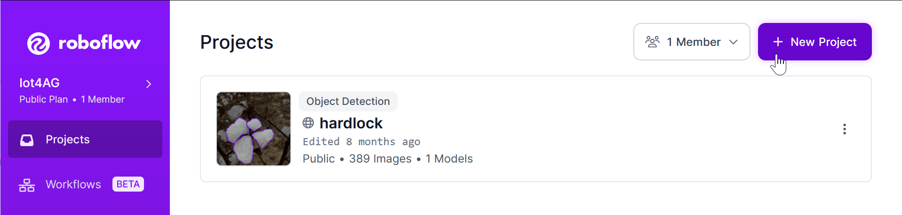
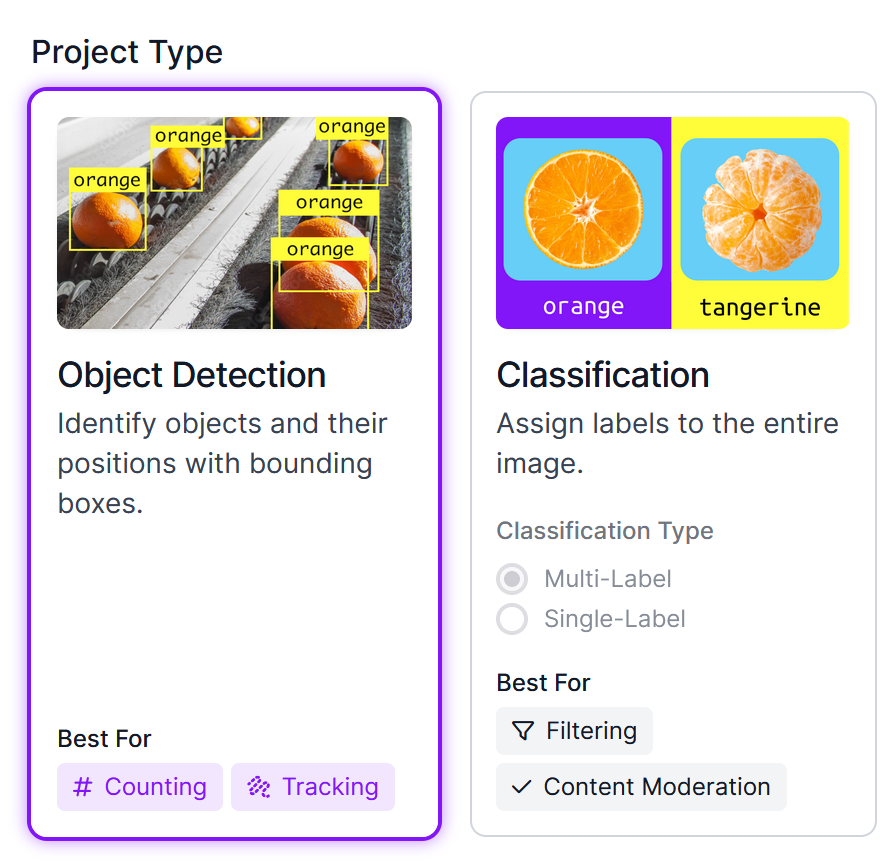
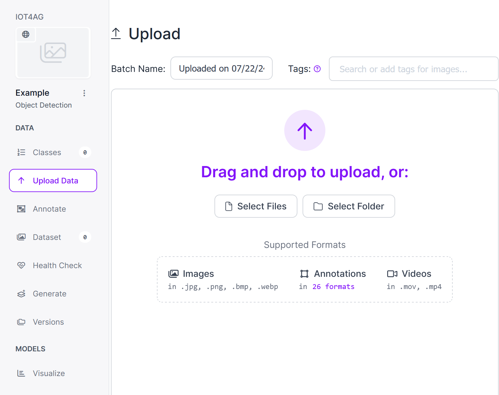
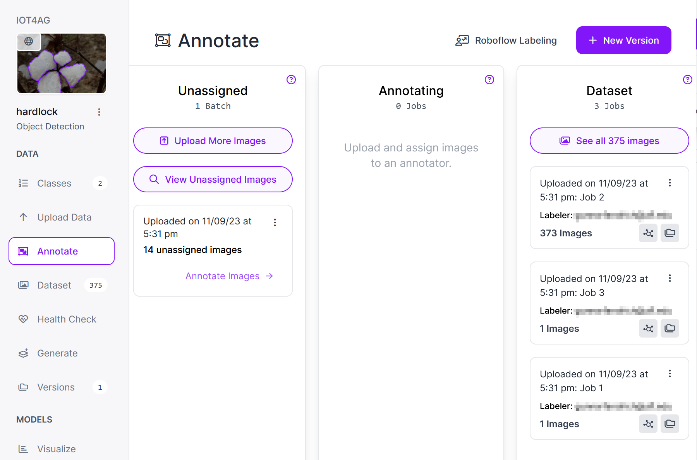
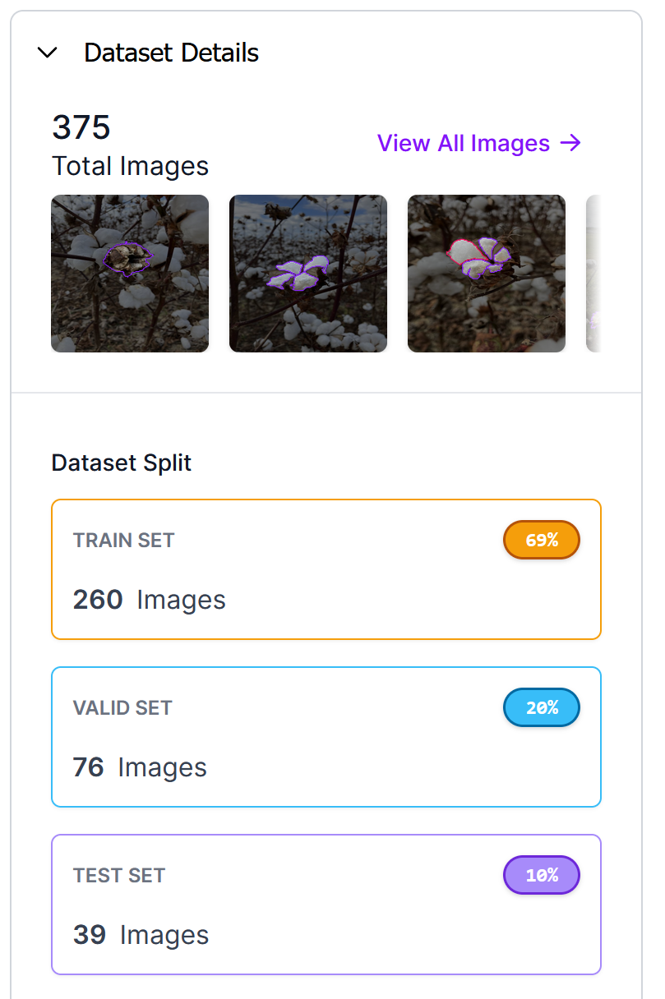
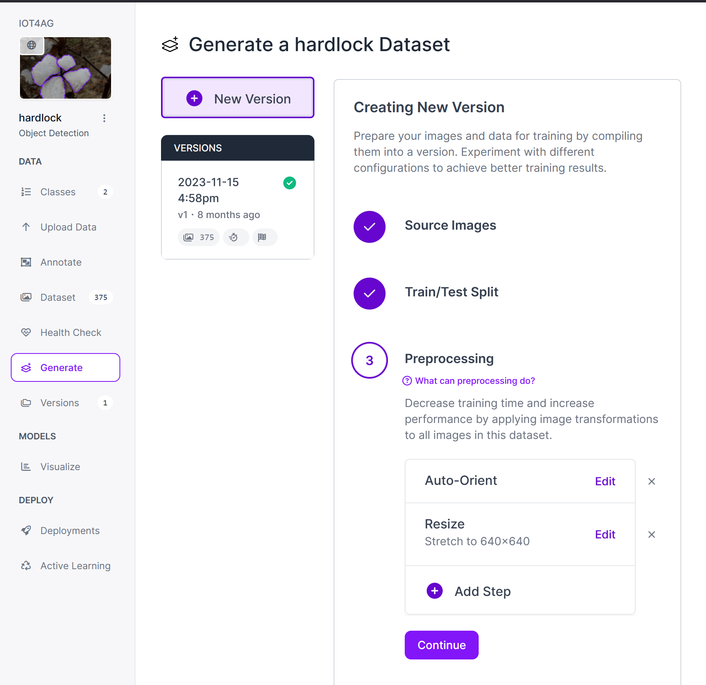

# Sentinel Machine Learning Overview

The Jetson Orin Nano is quite capable of processing machine learning data in real-time when utilizing a pre-generated model. This document will detail the steps required to process live video feed with a generated machine learning model on the Jetson Orin Nano.

## Required Software and Tools
* Access to [roboflow](https://app.roboflow.com)
    * An account can be made for free in a few minutes.
* [roboflow inference](https://github.com/roboflow/inference)
    * Pre-built binaries are not currently available for the ARM64 architecture. ARM64 binaries will need to be built from source. Alternatively, a pre-made docker image can be utilized.

## Roboflow Setup and Model Training

After proceeding to the roboflow website and creating a free account and workspace, users can create a new project.

Upon creating a new project, users will need to select a project type. In this example, where cotton hardlock is to be evaluated, object detection is selected. Other projects may require other project types. Roboflow offers many other project types in addition to object detection and image classification.

Once a new project has been created, users should upload images or folders of images that will be annotated and processed to create a model. YouTube videos can also be utilized for frame extraction, though this process will not be explained in this overview.

> **NOTE**  
> It is crucial to have a statistically significant image pool when developing a machine learning model. Not enough images tends to result in overfitting and other inaccuracies. In this example dataset, 375 images were uploaded.

After uploading images, users should annotate their images with the desired classifications or labels.

Once annotation is complete, be sure to assign an appropriate number of images to train, test, and validation groups. This example possessed the following train, test, and validation sizes:
* Train Set: 260 Images
* Validation Set: 76 Images
* Test Set: 39 Images

## Roboflow Model Processing

After all the prior setup steps have been completed, users can generate their model.

As seen in the image above, prior to model creation, users can select desired data preprocessing and data augmentation. For users new to machine learning in general, it would be wise to use minimum data preprocessing and augmentation.

A good textbook to read for those wanting to learn more information about machine learning in general can be found [here](https://www.amazon.com/Python-Machine-Learning-scikit-learn-TensorFlow-dp-1789955750/dp/1789955750/ref=dp_ob_title_bk). The book ISBN-10 is: 1789955750 (this information is provided in the event the link ever becomes obselete). This book is recommended for those with a strong knowledge of statistics and linear algebra.
> **NOTE**
> The writers of this textbook have in NO WAY endorsed or even acknowledged this github repository. This textbook is provided as a reference ONLY.

## Local Model Execution on Jetson Orin Nano

The maintainers of roboflow were kind enough to provide a good write-up of the process to run roboflow-inference on the Jetson Orin Nano can be found [here](https://blog.roboflow.com/license-plate-detection-jetson/).
